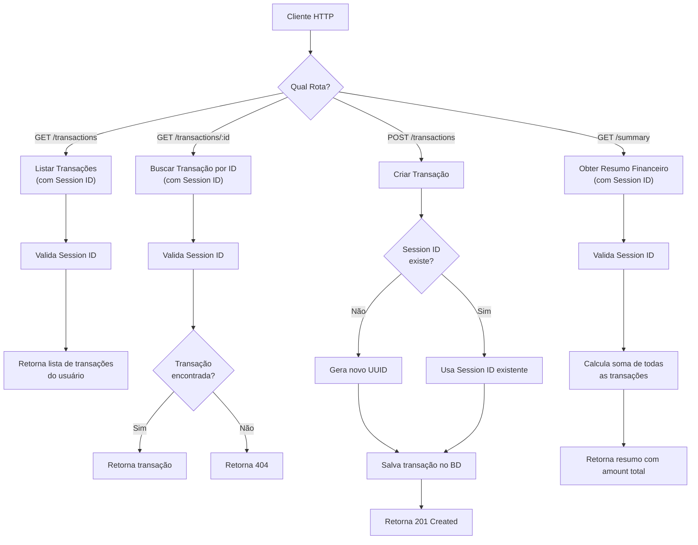
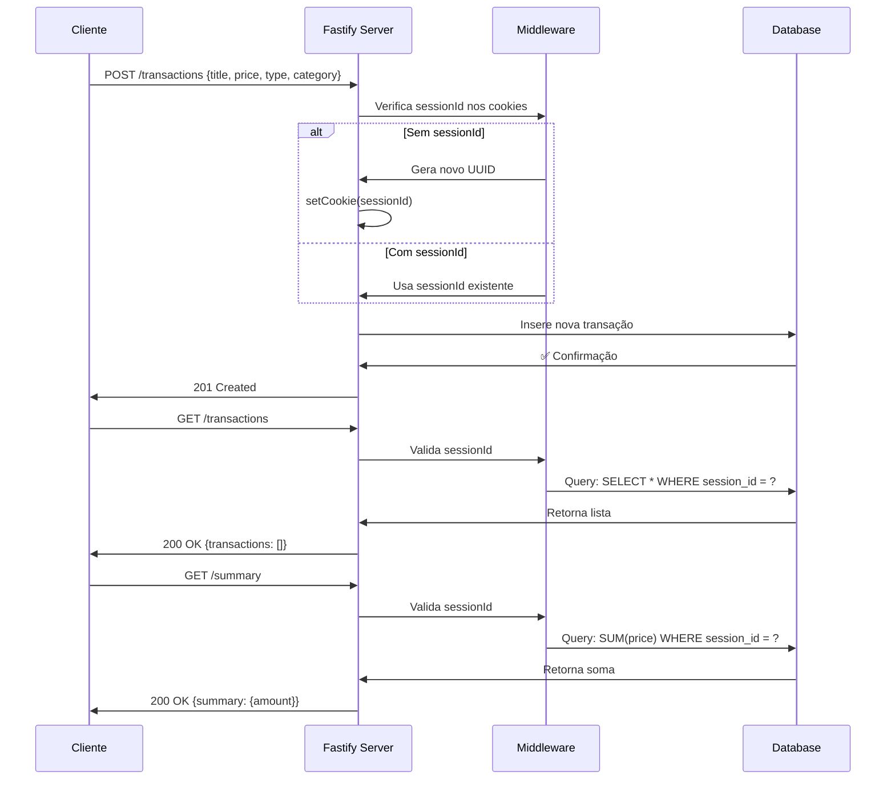

# Diagrama de Rotas - API Gerenciador de Transações

## Fluxo das Principais Rotas



## Detalhes das Rotas

### 📥 **Entrada de Rotas**

| Método | Rota                | Descrição                            | Autenticação                 |
| ------ | ------------------- | ------------------------------------ | ---------------------------- |
| `GET`  | `/transactions`     | Lista todas as transações do usuário | Session Cookie ✅            |
| `GET`  | `/transactions/:id` | Busca uma transação específica       | Session Cookie ✅            |
| `POST` | `/transactions`     | Cria uma nova transação              | Automática (cria/usa cookie) |
| `GET`  | `/summary`          | Retorna resumo financeiro            | Session Cookie ✅            |

### 🔐 **Middleware de Segurança**

- **`checkSessionIdExists`**: Valida se o `sessionId` está presente nos cookies nas rotas GET `/transactions`, GET `/transactions/:id` e GET `/summary`
- Cookie de sessão válido por: **7 dias**

### 📊 **Fluxo de Dados**



---

## 🚀 Exemplos de Requisições

### Criar uma Transação

```bash
curl -X POST http://localhost:3000/transactions \
  -H "Content-Type: application/json" \
  -d '{
    "title": "Venda de Produtos",
    "price": 150.50,
    "type": "income",
    "category": "Vendas"
  }'
```

### Listar Transações

```bash
curl http://localhost:3000/transactions
```

### Buscar Transação por ID

```bash
curl http://localhost:3000/transactions/{id}
```

### Obter Resumo Financeiro

```bash
curl http://localhost:3000/summary
```

---

**Voltar para [README](README.md)**
